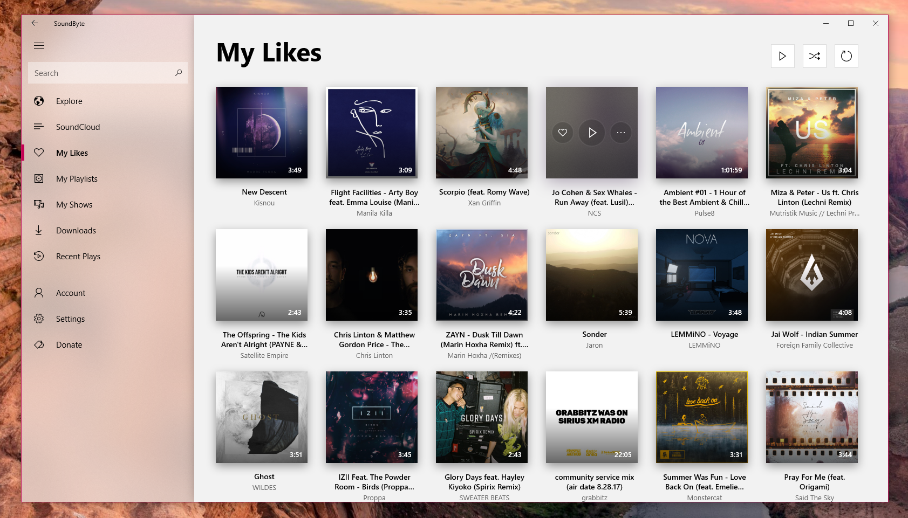

<h1 align="center">
SoundByte
</h1>



<h4 align="center">Music client for Windows 10 &amp; Xbox One (with other platforms in development) supporting SoundCloud, YouTube, Fanburst, Local Playback* and Podcasts*.</h4>

<p>*Features still in development.</p>

<p align="center">
    <a href="https://github.com/DominicMaas/SoundByte/issues">
        
    </a>
    <a href="https://discord.gg/tftSadE">
        
    </a>
    <a href="#">
     
    </a> 
</p>

## Introduction
SoundByte is a Windows 10 and Xbox One app (with other platforms in development) that intergrates with the SoundCloud, Fanburst and YouTube APIs allowing a user to listen to these platforms natively. SoundByte will also support local playback and podcasts in the future. Currently SoundByte supports UWP (Windows 10) and is published through the Windows Store for free.

Please Note: SoundByte source code is to only be used for educational purposes. Distrubution of SoundByte source code in any form outside this repository is forbidden.

## SoundByte Structure
SoundByte is split into the following projects: `SoundByte.Android`, `SoundByte.MacOS`, `SoundByte.Core`, `SoundByte.iOS` and `SoundByte.UWP`. Each of these projects and containing files are mentioned in more detail below.

|Project Name|Platform|Description|
|--|--|--|
|`SoundByte.Android`|Xamarin Native (Android)|WIP Xamarin Native app for Android phones|
|`SoundByte.MacOS`|Xamarin Native (macOS)|WIP Xamarin Native app for macOS|
|`SoundByte.Core`|.NET Standard v1.4|Core logic used by all projects within SoundByte|
|`SoundByte.iOS`|Xamarin Native (iOS)|WIP Xamarin Native app for iOS|
|`SoundByte.UWP`|UWP 10.0 - Fall Creators Update - see `cu_stable` for Creators Update support|Windows 10 UWP App (Windows 10/Xbox One)|

**SoundByte.Android:** Very basic UI, allows searching for "Monstercat" through the SoundCloud API. Supports single playback items.

**SoundByte.Core:** SoundByte Core is a cross-platform library built using .NET standard. This library contains logic for interacting with muiltiple services such as Fanburst, SoundCloud and YouTube. The main entry point for accessing content in this library is the `SoundByteV3Service` class within the `SoundByte.Core.Services` namespace. Details on how to use this class are mentioned below:

Before calling the `SoundByteV3Service` class, you must first set it up. This is done by calling `SoundByteV3Service.Current.Init();` This function takes in a list of service-secrets. A `ServiceSecret` is required for every service that you want to access information with. For example, if accessing information from SoundCloud, you must provide a SoundCloud service secret. An example of this is below.

```
var soundCloudSecret = new ServiceSecret
{
    Service = ServiceType.SoundCloud,
    ClientId = "client_id"
};
```

This is repeated for all the services you would like to use. When supplying the service secret, you can also provide a `LoginToken`. This is the logged in users state. You can also call `SoundByteV3Service.Current.ConnectService(ServiceType, LoginToken)`. Please note, the core SoundByte service is event based. This means that calling `ConnectService` will not return true or false, but instead call the `ServiceConnected` event handler which you bind to.

Each SoundByte endpoint has its own namespace within the `items` namespace. For example, information about tracks is stored in the `SoundByte.Core.Items.Track` namespace. These namespaces will contain certain classes to aid in muilti-service support. Details about these classes are below:

|Class Name|Description|
|:-|:-|
|`Base{{EndpointName}}.cs`|This class contains all the UI bindings and information about a certain items (track, user, etc.). It is the general SoundByte universal track class, service specific classes should map their values to this class.|
|`I{{EndpointName}}.cs`|Interface for all service specific items to extend off of. This interface has one overridable method allowing the conversion of service specific item into a universal 'Base{{EndpointName}}' item. A name for this method is `.ToBaseTrack();` for example.|
|`{{ServiceName}}{{EndpointName}}.cs`|This is the raw deserializable class for the SoundByte Service to deserialize data into to. Each service in the app that wishes to expose tracks for example, would have to create a `SoundCloudTrack.cs` class extending off `ITrack.cs` implementing the overridable method to convert the `SoundCloudTrack.cs` class into a `BaseTrack.cs` class. When grabbing tracks from the SoundCloud API you would use the data type as `SoundCloudTrack.cs` but when you go to add the item to the UI / List, call the `.ToBaseTrack();` method on each item.|

Every item in SoundByte following the above logic. This allows easy extensions of the app to support more services in the future. It also allow very different APIs to convert their code into a universal SoundByte standard.

**SoundByte.UWP:** This project contains the main code for SoundByte on Windows 10 / Xbox One. Items such as brushes, view models, models, views, playback service etc. are all stored here.

SoundByte logic is based around a central XAML/C# file called `AppShell.xaml`/`AppShell.xaml.cs`. This file displays key app elements such as the left hand navigation pane, and mobile navigation bar. It also supports app navigation, and is used to load key app resources at load time.

The `Views` folder contains XAML pages used within the app. Generally there is one xaml page per app page (using visual state triggers to change certain UI elements depending on the platform). The code behind these pages is usually simple, only containing the view model logic and telemetry logic.

The `ViewModels` folder contains all the view models for the app. A view model class will typically extend `INotifyPropertyChanged` and `IDisposable` (although IDisposable is not currently used). These classes usually are linked with a view and contain logic for said view.

The `UserControls` folder contains the XAML and behind code for common user controls within the app. For example the stream item, and notification item.

The `Services` folder contains static services used around the app. Noticable examples are the Playback Service (handles starting songs and playing / pausing songs) and the SoundByte service (used by the app to login / logout, access api resources etc.)

## Features
- **SoundCloud API:** SoundByte is able to access the SoundCloud API either logged in or logged out. When logged out a user can serarch for music and then play the music. When logged in, a user can like / repost items, add items to their playlist, view their history, likes, stream, created/liked playlists and notifications. When also logged in the user can upload their own music to the SoundCloud API.

- **Fanburst API:** Support for Fanburst is still in early stages, currently a user can search for Fanburst songs and play them. Basic login is also supported, but not currently used. In the future, we plan on extending this API into the rest of the app (such as likes, history etc.) and at the same time, hopefully make the app more modular, allowing for more service intergration in the future.

- **Background Audio:** SoundByte supports playback of audio in the background using the Single Process Background Audio API. This allows the ability to play music when the screen is turned off (phone), when the app is minimised (desktop) or while playing a game (Xbox).

- **Background Notifications:** Initial versions of SoundByte supported background notifications that were provided by a background timer service that ran every 15 minutes. This service would update a temporary list with all new items in the users stream since the last check, and display notifications for these items. This newly open-sourced version of SoundByte no longer supports this notification system due to instability issues. 

## Download
SoundByte can be either downloaded from the Windows Store [here](https://www.microsoft.com/store/apps/9nblggh4xbjg). Windows 10 Creators Update or newer is required to run SoundByte. If you would like to run beta version (compiled every Sunday) direct message the SoundByte twitter (@SoundByteUWP).

## Development

Simply clone the repo to get started. SoundByte will download the required information from the SoundByte servers on app startup.

## Credits

- **[Dominic Maas](https://twitter.com/dominicjmaas)**  - *App Development*
- **[Dennis Bednarz](https://twitter.com/DennisBednarz)**  - *App UI/UX Design*

See also the list of [contributors](https://github.com/DominicMaas/SoundByte/contributors) who participated in this project.

## License

Copyright (c) 2016 - 2017, Grid Entertainment

*All Rights Reserved*

This source code is to only be used for educational purposes. Distribution of SoundByte source code in any form outside this repository is forbidden. If you would like to contribute to the SoundByte source code, you are welcome.
