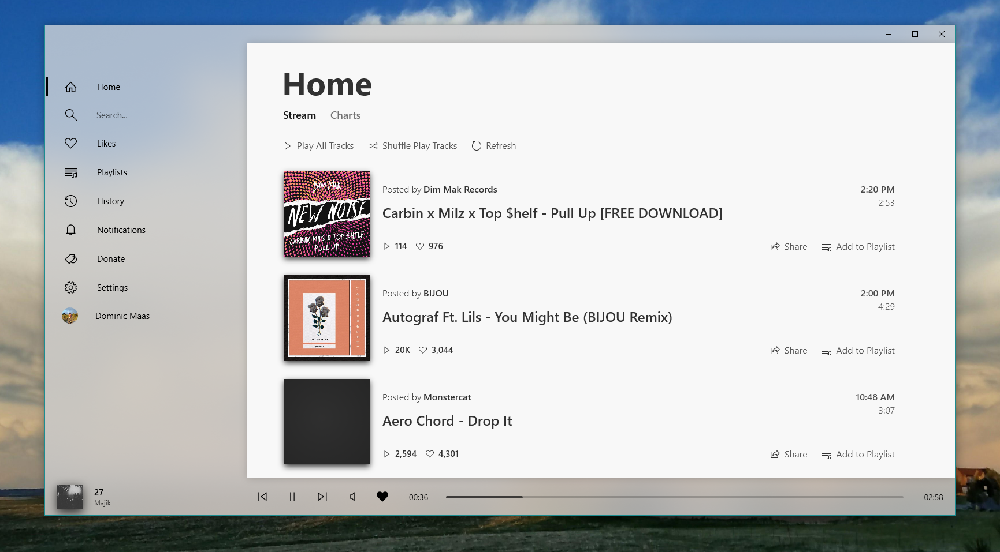

<h1 align="center">
SoundByte
</h1>

<h4 align="center">A <a href="https://soundcloud.com/" target="_blank">SoundCloud</a> &amp; <a href="https://fanburst.com/" target="_blank">Fanburst</a> Client for Windows 10 &amp; Xbox One.</h4>

    
    

## `cu_stable` Branch
Please Note: This branch is used to deliver updates to Windows 10 PCs running the Windows 10 Creators Update. Core Project and other projects are in the `master` branch.
